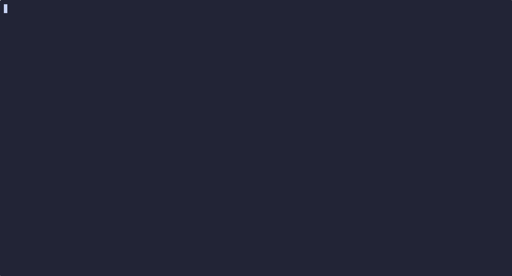

# termines

A minimalist, terminal-first Minesweeper clone written in Go.

## Overview



**termines** brings the classic logic puzzle to your terminal with a focus on speed, responsiveness, and clean design. Built using the [ttasc/ttbox](https://github.com/ttasc/ttbox) library, it leverages a non-blocking event loop to provide smooth gameplay whether you prefer the mouse, the keyboard, or strict Vim-style navigation.

It exists as both a fully playable game and a practical reference implementation for building structured, state-driven TUI applications in Go without over-engineering.

## Features

- **Input Freedom**: Full support for Mouse (Left/Right click) and Keyboard (Arrows or `hjkl`).
- **Fair Play**: Guaranteed safe first-click mine generation.
- **Responsive UI**: The board and UI elements dynamically center themselves based on your terminal window size.
- **Three Difficulties**: Easy, Medium, and Hard presets.
- **Zero Fluff**: A tiny, readable codebase with minimal external dependencies.

## Installation

You can download the pre-built binary file [here](https://github.com/ttasc/termines/releases/latest) or build from source:

```bash
git clone https://github.com/ttasc/termines.git
cd termines
go build -o termines
```

## Usage

Simply run the executable. You can interact with the game using either your mouse or keyboard.
```sh
./gotermoku
```

### Controls

| Action | Keyboard | Mouse |
| :--- | :--- | :--- |
| **Move Cursor** | `h`, `j`, `k`, `l` / Arrows | Move Mouse |
| **Reveal Cell** | `Space` / `Enter` | Left-Click |
| **Toggle Flag** | `f` / `F` | Right-Click |
| **Reset Game** | `r` / `R` | Left-Click `[ RESET ]` |
| **Change Difficulty** | `1`, `2`, `3` | Left-Click `[ MODE ]` |
| **Quit** | `ESC` | - |

## Architecture

The project adheres to a strict separation of concerns, ensuring that rendering, logic, and state management never bleed into each other.

- `state.go`: **The Source of Truth.** Defines the data models (`GameState`, `Cell`) and state initialization. Holds all mutable data including the grid, timers, and cursor position.
- `main.go`: **The Orchestrator.** Bootstraps the terminal, manages the application lifecycle, and runs the continuous, non-blocking 100ms game loop.
- `input.go`: **The Translator.** Parses raw terminal events (keys and mouse coordinates) and maps them to logical game intents.
- `logic.go`: **The Ruleset.** Implements the core gameplay mechanics, including fair mine generation and the Breadth-First Search (BFS) flood-fill algorithm for revealing empty areas.
- `renderer.go`: **The View.** A pure function of the state. Clears and redraws the terminal screen every frame, handling spatial math, aspect ratio correction (3:1 character grids), and color formatting.

## Design Philosophy

- **Minimalism**: Code should do exactly what it needs to do and nothing more. No complex design patterns where a simple function suffices.
- **Readability Over Cleverness**: Algorithms like the BFS flood-fill are written explicitly. It favors standard control structures over dense, chained abstractions.
- **Terminal-First UX**: Terminals have unique constraints (rectangular character cells, specific color palettes). The UI is mathematically constructed to look balanced and readable natively, rather than trying to emulate a web or GUI layout.

## Contributing

Contributions are welcome! Whether it's a bug fix, an optimization, or a minor UI tweak, feel free to open a PR.

Please ensure your code aligns with the minimalist philosophy: keep abstractions low, rely on standard Go idioms, and ensure the terminal UI remains fast and responsive.

## License

MIT License. See `LICENSE` for details.
